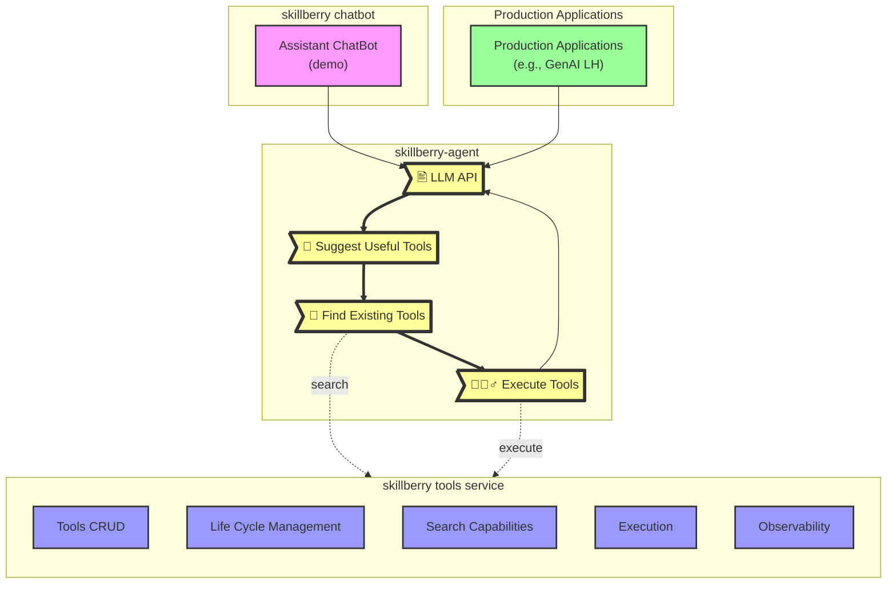

# skillberry-agent

An AI agent system that leverages existing tools to accomplish tasks efficiently and accurately.

## Features ✨

- **Improve AI accuracy and correctness**: Uses LLM and tools in tandem to improve accuracy and correctness.
- **Reduce AI systems TCO**: Offloading computational processes to CPU-based deterministic tools.
- **Tools usage**: Enforce usage of deterministic tools as part of AI systems.
- **Function calling**: Interface with tools-store-backends and search capabilities to efficiently use AI function calling.
- **Operational API**: Expose LLM chat completion API allowing integration with any AI application, e.g., AI Agents
- **Configuration API**: Expose API allowing management of configurations such as: tools store backend, LLM used.


    
## Quickstart 🚀

❗Ensure that the [skillberry-store](https://github.ibm.com/skillberry/skillberry-store) is running.
❗Make sure you are logged in to the ICR Docker registry. [details here](docs/container-reigistry.md)

### Run the service with Docker or Podman 🐳


```bash
docker run --name skillberry-agent --env RITS_API_KEY -d -u 1000:1000 -v /tmp:/tmp --network=host skillberry-1.vpc.cloud9.ibm.com:8800/skillberry-dev/skillberry-agent:latest
```

Alternatively, you can use the make command, which does the same:
```bash
make docker_run
```

>*Note:* Use `make help` to view a list of additional available operations.

### Interact with the service API (via OpenAPI) 📜

Open a browser against `http://127.0.0.1:7000/docs`.

### Interact with the service via Python SDK or CLI 🐍

You can use either the Python SDK or a Command Line Interface (CLI) to interact with the service.
For installation and usage instructions, refer to the [skillberry-agent-sdk](https://github.ibm.com/skillberry/skillberry-agent/client/python/).

### Prerequisites 🛠️

- Export or use `.env` file to set `RITS_API_KEY` for accessing LLMs via RITS:

```bash
export RITS_API_KEY=********************************
```

- Alternatively, set `WATSONX_APIKEY`, `WATSONX_PROJECT_ID` and `WATSONX_URL` for accessing LLMs via WatsonX

```bash
export WATSONX_APIKEY=********************************
export WATSONX_PROJECT_ID=********************************
export WATSONX_URL=https://us-south.ml.cloud.ibm.com
```

### Local Setup and Running the Service 🧰

```bash
cd ~
git clone git@github.ibm.com:skillberry/skillberry-agent.git
cd skillberry-agent
make run
```

>*Note:* By default, SBA runs on host `0.0.0.0` and port `7000`, `7001`. To change, set the environment variables SBA_PORT, SBA_CONFIG_PORT and/or SBA_HOST

### Interact with the configuration API 📜

Open a browser against `http://127.0.0.1:7001`.

---

## 📚 Additional documentation can be found at [docs](docs).
