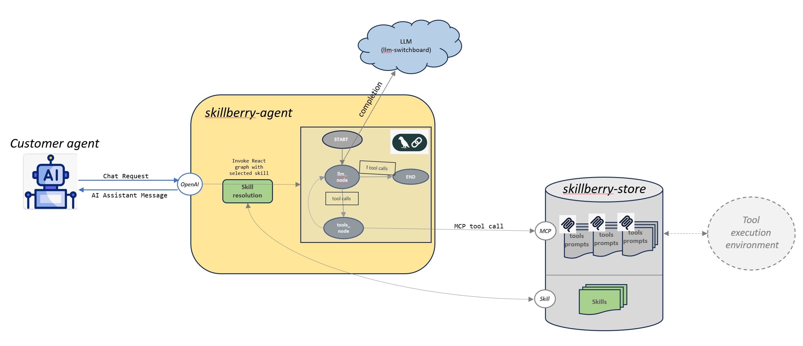

# Skillberry Proxy-Agent (SPA)

A proxy-agent service that orchestrates intelligent interactions between customer agents and the Skillberry ecosystem. The Skillberry Proxy-Agent acts as the central coordinator for LLM communication, skill resolution, and response optimization. Seamlessly integrates with Skillberry Store for dynamic tool discovery and execution through MCP protocols. Accessed via OpenAI-compatible endpoints (e.g., chat completions API) for seamless integration with existing AI applications.



## Features ✨

- **Proxy-Agent Orchestration**: Central coordinator managing interactions between customer agents and Skillberry Store
- **LLM Integration**: Seamless communication with language models via standardized API endpoints
- **MCP Tools Management**: Access and orchestration of relevant skills through MCP API tools and prompts
- **MCP Prompts/Snippets Support**: Skills can provide contextual instructions that are automatically injected into agent system prompts, enabling domain-specific guidance and behavior customization
- **Response Optimization**: Enhanced and optimized responses before delivery to customer agents
- **Trajectory Tracking**: Complete audit trail of agent decisions and tool usage for continuous improvement
- **VMCP Server Management**: Thread-safe virtual MCP server lifecycle per session
- **Reduce AI Systems TCO**: Offloading computational processes to CPU-based deterministic tools
- **Operational API**: OpenAI-compatible chat completion endpoints for seamless integration
- **Configuration Management**: Flexible configuration of tools store backend and LLM providers

## Quickstart 🚀

❗Ensure that the [skillberry-store](https://github.com/skillberry-ai/skillberry-store) is running.

## Prerequisites 🛠️

### LLM Provider Configuration

The agent supports multiple LLM providers through environment variables.

**Using .env file (Recommended for local development):**

1. Copy the example file:
   ```bash
   cp .env.example .env
   ```

2. Edit `.env` with your credentials and configuration:
   ```bash
   # Choose your provider
   SPA_PROVIDER_NAME=openai.sync
   SPA_MODEL_NAME=gpt-4
   
   # Set provider credentials
   OPENAI_API_KEY=********************************
   ```

3. The `.env` file is automatically loaded on startup

**Or export environment variables directly:**

#### OpenAI (Recommended for getting started)
```bash
export OPENAI_API_KEY=********************************
export SPA_PROVIDER_NAME=openai.sync
export SPA_MODEL_NAME=gpt-4
```

**Note:** You can also configure provider and model via the Configuration UI at `http://localhost:7001`

For more providers and detailed configuration, see [docs/ports-and-env-vars.md](docs/ports-and-env-vars.md) and [.env.example](.env.example).

## Local Setup and Running the Service 🧰

```bash
cd ~
git clone git@github.com:skillberry-ai/skillberry-agent.git
cd skillberry-agent
make run
```

### Interact with the configuration API 📜

Open a browser against `http://127.0.0.1:7001`.

## Configuration 🎛️

### Agent Behavior

Configure agent behavior using environment variables:

**Skill Selection** (choose one):
```bash
# Option 1: Direct skill UUID (highest priority)
export SKILL_UUID=abc-123-def-456

# Option 2: Skill name (resolves to UUID automatically)
export SKILL_NAME=weather-tool
```

**Optional Settings**:
```bash
# Enable thinking logs in responses (useful for debugging)
export ENABLE_THINK_LOGS=true
```

### API Endpoints

| Endpoint | Purpose | Port |
|----------|---------|------|
| `/chat/completions` | OpenAI-compatible chat completion | 7000 |
| `/v1/chat/completions` | Alternative endpoint path | 7000 |
| `/prompt` | Simplified prompt endpoint | 7000 |
| Configuration API | Manage configurations | 7001 |

---

## 📚 Additional documentation can be found at [docs](docs).

* Library usage and API reference: [skillberry-agent-lib README](shared/python/skillberry_agent_lib/README.md)
* Port and environment variable details: [docs/ports-and-env-vars.md](docs/ports-and-env-vars.md)
