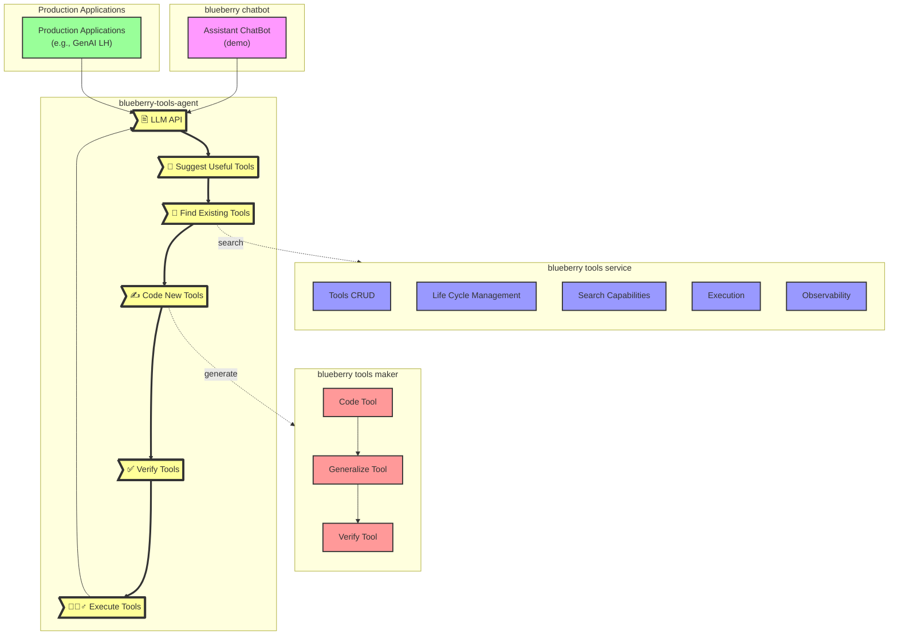

# blueberry-tools-agent

An AI system designed to automate gradual reprogramming of workflows with both existing and generated tools in such a way that the proportion of using high-quality deterministic tools increases on the paths most susceptible to hallucinations

## Features ✨

- **Improve AI accuracy and correctness**: Uses LLM and tools in tundam to improve accuracy and correctness.
- **Reduce AI systems TCO**: offloading computational processes to CPUs based deterministic tools.
- **Continuous performance improvement as part of inferencing**: gradualy reprogram workflows by generation and usage of high-quality deterministic tools.
- **Use case specific**: Provide value for repeated execution of workflows.
- **Tools usage**: Enforce usage of deterministic tools as part of AI systems.
- **Function calling**: Interface with tools-store-backends and search capabilities to efficiently use AI function calling.
- **Tools maker**: Interface with LLM-as-a-coder componets to generate hige-quality deterministic tools.
- **Operational API**: Expose LLM chat completion API allowing integration with any AI application, e.g., AI Agents
- **Configuration API**: Expose API allowing managment of configurations such as: tools store backend, coder backend, LLM used.


    
## Quickstart 🚀

### Start the Service

```bash
make docker_run
```

> Note: use `make help` for additional avaialbale operations

### Engage with the operational API (via OpenAPI) 📜

Open a browser against `http://127.0.0.1:7000/docs`.

### Prerequisites 🛠️

- Use the `.env` file to define the `RITS_API_KEY` variable:

```bash
RITS_API_KEY=********************************
```

### Local Installation 📦

```bash
cd ~
git clone git@github.ibm.com:Blueberry/blueberry-tools-agent.git
cd blueberry-tools-agent
pip install -r requirements.txt
```

### Start the Service 🚀

```bash
make run
```

### Engage with the configuration API 📜

Open a browser against `http://127.0.0.1:7001`.
